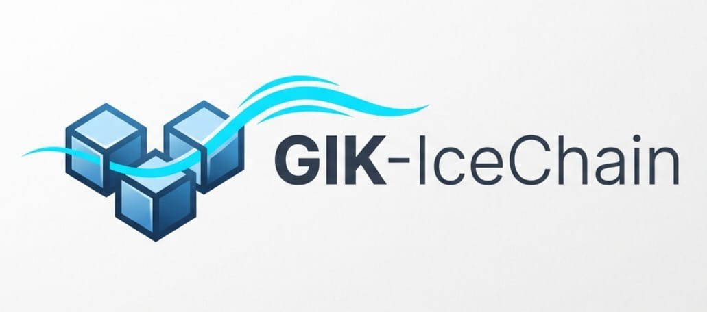

<p align="center">
  
</p>

# GIK-IceChain v2.0

**Zero-Cost Cloud-Native Pipeline for Retrospective Flood Risk  
Decision Support in East Africa using the ECMWF IFS Ensemble**

> **ECMWF Code for Earth 2026  -  Africa Stream (ArcX)**  
> Challenge 41: Missed Opportunities in Flood Disaster Risk Management  
> Mentors: Nishadh Kalladath · Masilin Gudoshava · Ahmed Amdihun · Anthony Mwanthi · Katherine Egan · Jessica Keune · Hillary Koros

[](LICENSE)
[](https://python.org)
[](https://github.com/astral-sh/ruff)
[](https://github.com/hashirama21/gik-icechain/actions)
[](https://colab.research.google.com/github/hashirama21/gik-icechain/blob/main/notebooks/colab_e2e_test.ipynb)

---

## Overview

ECMWF's open IFS ensemble archive on AWS S3 (`s3://ecmwf-forecasts`) holds over
**1 petabyte** of GRIB2 weather forecast data: 51 ensemble members, 85 forecast steps
(0–360 h), and more than 1 000 forecast days since May 2023  -  all freely available.
Yet this data is almost completely inaccessible to the xarray/Dask ecosystem that
East African disaster risk managers rely on.

GIK-IceChain v2.0 solves this in three components:

| Component | What it does | Key output |
|-----------|-------------|-----------|
| **C1  -  Conversion** | GIK Parquet manifests → VirtualiZarr → IceChunk Zarr v3 virtual store | Single `zarr.open()` access to 1 000+ days, zero data duplication |
| **C2  -  Exceedance** | Retrospective rainfall exceedance probabilities for all ~1 000 days | Multi-dim Zarr: `date × lat × lon × window × return_period` |
| **C3  -  Risk (CRMA)** | Admin-1 daily flood risk using ICPAC's CRMA Bayesian Network | Daily GeoJSON risk layer, integrated in calendar-map storymaps |

### Key numbers

| Metric | Value |
|--------|-------|
| Archive size | ~1 PB (raw GRIB2) |
| Virtual store size | ~18.5 GB (metadata only, **48 000× compression**) |
| Days covered | ~1 200 (May 2023 – Aug 2026) |
| Ensemble members | 51 |
| Accumulation windows | 7 (3 h → 7 days) |
| Return-period thresholds | 6 (2, 5, 10, 20, 40, 100 years) |
| Admin-1 units | ~300 (11 East African countries) |


## Architecture

```mermaid
flowchart TD
    %% ==================== SOURCES ====================
    subgraph Sources["DATA SOURCES"]
        S3[AWS S3<br/><b>s3://ecmwf-forecasts</b><br/>~1 PB GRIB2]
        HF[HuggingFace<br/><b>E4DRR/gik-ecmwf-par</b><br/>150 246 Parquet files]

        S3 ---|"51 members × 85 steps<br/>~1000 days since May 2023"| GRIB[GRIB2 Raw Files]
        HF ---|"Metadata only<br/>18.5 GB"| Parquet[Parquet Files]
    end

    %% ==================== C1 : VIRTUAL STORE ====================
    subgraph C1["C1  -  IceChunk Virtual Store"]
        direction TB
        VZ[VirtualiZarr]
        IC[IceChunk<br/>Zarr v3]
        Store["IceChunk Zarr v3 Virtual Store<br/>Metadata Only  -  zarr.open&#40;store&#41;<br/>Full Time-Travel History"]

        GRIB & Parquet -->|"byte-range refs"| VZ
        VZ --> IC
        IC --> Store
    end

    %% ==================== C2 : EXCEEDANCE ====================
    subgraph C2["C2  -  Exceedance Analysis"]
        direction TB
        Manifest["Manifest-Aware Loader<br/>VirtualChunkRefs from IceChunk"]
        Coalesce["Byte-Range Coalescence<br/>~714 ranges → ~60 S3 requests"]
        Fetch["Parallel S3 Fetch<br/>ThreadPoolExecutor"]
        Decode["eccodes GRIB2 Decode<br/>+ bbox subsetting"]
        CMORPH[CMORPH + GPM IMERG<br/>Observations]
        Thresholds[Rolling Accumulations<br/>7 windows]
        GEV[GEV Adaptive Thresholds<br/>6 Return Periods]

        Store --> Manifest
        Manifest --> Coalesce
        Coalesce --> Fetch
        Fetch -->|"raw bytes"| Decode
        Decode -->|"xr.Dataset<br/>in-memory"| Thresholds
        CMORPH --> Thresholds
        Thresholds --> GEV
    end

    %% ==================== C3 : CRMA-LIVE ====================
    subgraph C3["C3  -  CRMA-Live Risk Engine"]
        direction TB
        DBN[Dynamic Bayesian Network<br/>pgmpy]
        Soil[Soil Saturation Persistence<br/>API Node]
        EMDAT[EM-DAT CPT Refinement]
        Risk["Admin-1 Traffic-Light Risk<br/>~300 administrative units"]

        GEV --> DBN
        DBN --> Soil
        Soil --> EMDAT
        EMDAT --> Risk
    end

    %% ==================== DASHBOARD ====================
    subgraph Dashboard["DASHBOARD & VISUALISATION"]
        direction TB
        Calendar[Calendar-Map View]
        TiTiler[TiTiler<br/>AWS Lambda]
        Storymaps[VEDA Storymaps]
        Final["One cell per day<br/>→ Click → Full Storymap"]

        Risk --> Calendar
        Calendar --> TiTiler
        TiTiler --> Storymaps
        Storymaps --> Final
    end

    %% Main flow
    Sources --> C1
    C1 --> C2
    C2 --> C3
    C3 --> Dashboard

    %% Styles
    classDef source fill:#1e40af,stroke:#60a5fa,stroke-width:2px,color:#fff
    classDef core fill:#166534,stroke:#4ade80,stroke-width:3px,color:#fff
    classDef process fill:#312e81,stroke:#818cf8,stroke-width:2px,color:#fff
    classDef final fill:#854d0e,stroke:#fbbf24,stroke-width:3px,color:#fff

    class Sources source
    class C1 core
    class C2,C3 process
    class Dashboard final
```


---

## Components

### Component 1  -  GIK to IceChunk Conversion

Converts the 150 246 GIK Parquet reference files (already available on
[HuggingFace E4DRR/gik-ecmwf-par](https://huggingface.co/datasets/E4DRR/gik-ecmwf-par))
into a fully interoperable **IceChunk Zarr v3 virtual store**  -  with zero data
duplication. The original GRIB2 objects on S3 are never copied; only byte-range
references are stored.

**Innovation 1  -  IceChunk Time-Travel Audit Trail**: every daily GIK batch
is committed as a new IceChunk snapshot. Users can check out the store as it
existed on any past date, enabling reproducible "what would we have known on
date X?" retrospective queries  -  directly applicable to anticipatory action protocols.

### Component 2  -  Retrospective Exceedance Analysis

For each of ~1 000 forecast days, 51 ensemble members, 7 accumulation windows,
and 6 return-period thresholds:

1. **Manifest-aware loader** reads VirtualChunkRefs directly from the IceChunk
   store (no HuggingFace access, no global grid in memory)
2. **Byte-range coalescence** merges adjacent S3 ranges (~714 individual chunks
   down to ~60-80 coalesced requests per day)
3. **Parallel S3 fetch** via ThreadPoolExecutor retrieves raw GRIB2 bytes
4. **eccodes decode** with immediate bbox subsetting produces an in-memory
   `xr.Dataset(member, step, latitude, longitude)`
5. Computes rolling precipitation accumulations (7 windows: 3 h to 7 days)
6. Compares against **adaptive GEV thresholds** stratified by season and IOD/ENSO
   phase (Innovation 2  -  substantially reduces false alarm rates in dry regimes)
7. Outputs a multi-dimensional Zarr v3 store

The manifest-aware path is configurable via `component2.manifest_aware.enabled`
in `configs/default.yaml`. When disabled, C2 falls back to the standard
`xr.open_zarr()` + Dask path.

### Component 3  -  Admin-1 Risk Assessment (CRMA-Live)

Integrates ICPAC's [CRMA prototype](https://meetingorganizer.copernicus.org/EGU24/EGU24-6843.html)
(Bayesian Network, pgmpy) with two innovations:

**Innovation 4  -  Dynamic BN with API persistence**: adds an Antecedent
Precipitation Index (API) node that carries soil moisture state across days,
capturing multi-day compound flood risk.

**Innovation 5  -  EM-DAT CPT refinement**: uses historical EM-DAT flood events
to refine the Bayesian Network Conditional Probability Tables via maximum
likelihood estimation.

Output: daily admin-1 GeoJSON risk files, integrated directly into the
calendar-map storymaps and exportable to the
[East Africa Hazard Watch Portal](https://www.icpac.net/hazard-watch/).

---

## Quick Start

```bash
# Clone and install
git clone https://github.com/hashirama21/gik-icechain.git
cd gik-icechain
pip install -e ".[dev]"

# Run only Component 1 (conversion)  -  store URI set in configs/default.yaml
python -m gik_icechain convert --start 2024-10-01 --end 2024-10-31

# Run only Component 2 (exceedance)
python -m gik_icechain exceedance \
  --store  s3://your-bucket/gik-icechain-store \
  --output s3://your-bucket/exceedance-zarr \
  --start  2024-10-01 \
  --end    2024-10-31

# Run only Component 3 (risk assessment)
python -m gik_icechain risk \
  --exceedance-store s3://your-bucket/exceedance-zarr \
  --output           results/admin1_risk/ \
  --start            2024-10-01 \
  --end              2024-10-31

# Run all three components end-to-end
python -m gik_icechain run-all \
  --start  2024-10-01 \
  --end    2024-10-31 \
  --output results/
```

---

## Installation

### Requirements

- Python 3.12+
- AWS credentials with read access to `s3://ecmwf-forecasts` (anonymous access, no keys needed)
- (Optional) Write access to your own S3 bucket for the IceChunk store and Zarr outputs

### Install

```bash
# Core pipeline
pip install -e "."

# With development tools (pytest, ruff, mypy, coverage)
pip install -e ".[dev]"

# With cloud extras (icechunk, virtualizarr, obstore)
pip install -e ".[cloud]"

# With visualisation extras (matplotlib, seaborn, plotly)
pip install -e ".[viz]"
```

### Configuration

Pipeline settings live in `configs/default.yaml`. Key sections:

- **`sources`**: HuggingFace dataset ID, S3 bucket, admin boundaries, EM-DAT path
- **`outputs`**: IceChunk store URI, exceedance store URI, risk output dir
- **`component2.manifest_aware`**: enable/disable manifest-aware loader, fetch workers, min members
- **`component2.byte_range_coalescing`**: coalescence gap/size thresholds

```bash
cp configs/default.yaml configs/local.yaml
# edit configs/local.yaml: set outputs.icechunk_store_uri, sources.*, etc.
python -m gik_icechain convert --start 2024-10-01 --end 2024-10-01 --config configs/local.yaml
```

---

## Data Sources

| Dataset | Description | Access | Used in |
|---------|-------------|--------|---------|
| `s3://ecmwf-forecasts` | ECMWF IFS ensemble (51 members, 85 steps, GRIB2) | Public, no auth | C1, C2 |
| `E4DRR/gik-ecmwf-par` | GIK Parquet references (HuggingFace) | Public | C1 |
| `dynamical.org IceChunk` | Full-copy Zarr v3 IFS ENS (benchmark baseline) | Public | C1 benchmark |
| `E4DRR/virtualizarr-stores` | CMORPH return-period thresholds | Public | C2 |
| GPM IMERG v7 | Satellite precipitation estimates | NASA, public | C2, C3 |
| EM-DAT | Global disaster database (flood events) | Free registration | C2 validation, C3 |
| OCHA/GADM admin-1 | East Africa administrative boundaries | Public | C3 |
| ERA5 (CDS) | Reanalysis for ENSO/IOD phase classification | Free (CDS account) | C2 thresholds |

---

## Innovations

| # | Name | Description | Benefit |
|---|------|-------------|---------|
| 1 | **IceChunk Time-Travel Audit** | Daily IceChunk commits → queryable historical store snapshots | Enables 'as-of date X' retrospective queries for anticipatory action |
| 2 | **Adaptive GEV Thresholds** | Return-period thresholds stratified by season + IOD/ENSO phase | Reduces false alarm rate; improves detection in wet regimes |
| 3 | **Manifest-Aware Loader + Byte-Range Coalescence** | Reads VirtualChunkRefs from IceChunk, coalesces adjacent S3 byte ranges, parallel fetch + eccodes decode | ~10× fewer S3 requests; no HuggingFace access; in-memory bbox subsetting |
| 4 | **AIFS vs IFS ENS Parallel** | Same pipeline applied to AIFS ENS (via ICPAC SEWAA-forecasts) | First systematic AI-NWP flood signal evaluation in East Africa |
| 5 | **CRMA-Live Dynamic BN** | API persistence node in Bayesian Network | Captures multi-day compound flood risk |
| 6 | **EM-DAT CPT Refinement** | Learn CPTs from historical EM-DAT events | Data-driven improvement of risk model over time |

---

## Benchmarks

Preliminary benchmarks (30-day window, East Africa domain):

| Approach | Storage | Time-to-first-byte | Full-scan (30 days) | S3 egress cost |
|----------|---------|--------------------|---------------------|---------------|
| GIK + IceChunk | **18.5 GB** (metadata) | < 2 s | ~45 min (32 vCPU) | ~$0.02/day |
| dynamical.org full copy | ~242 TB | < 1 s | ~20 min (32 vCPU) | ~$0.02/day |
| Herbie (on-the-fly) | 0 | > 60 s | Not feasible | High |

Full benchmark results: [`results/benchmarks/`](results/benchmarks/)  
Benchmark notebook: [`notebooks/04_benchmark_report.ipynb`](notebooks/04_benchmark_report.ipynb)

---

## Dashboard

The interactive calendar-map is deployed at:
**https://hashirama21.github.io/gik-icechain/**

- Each cell = one forecast day, coloured by peak East Africa exceedance signal
- Click any day → VEDA-UI storymap showing:
  - Spatial exceedance map (colour-graded by return period)
  - GPM IMERG observed rainfall
  - EM-DAT flood event overlays
  - Admin-1 CRMA-Live risk layer
  - ENSO/IOD phase metadata

---

## Developer Tools

All operational scripts are consolidated in a single Typer CLI:

```bash
python scripts/tools.py --help

# Benchmark IceChunk vs dynamical.org
python scripts/tools.py benchmark --gik-store s3://...

# Validate IceChunk store integrity (gaps, variables)
python scripts/tools.py validate-store --store-uri s3://...

# Download reference data (admin boundaries, thresholds, ENSO/IOD)
python scripts/tools.py download --component all

# Back-fill archive gaps into the IceChunk store
python scripts/tools.py gap-fill --start 2023-05-01 --end 2024-02-29

# Export risk GeoJSON to EAHW format
python scripts/tools.py export-eahw --risk-dir results/admin1_risk/ --output results/eahw/

# Validate risk outputs against EM-DAT historical flood events
python scripts/tools.py validate-emdat --risk-dir results/admin1_risk/
```

---

## Contributing

Contributions are welcome. Please open an issue or pull request on GitHub.

```bash
# Install dev dependencies
pip install -e ".[dev]"

# Run tests
pytest tests/unit/ -v

# Run linter
ruff check src/ tests/
```

---

## Citation

```bibtex
@software{gik_icechain_2026,
  title   = {{GIK-IceChain v2.0}: Zero-Cost Cloud-Native Pipeline for
             Retrospective Flood Risk Decision Support in East Africa},
  author  = {Dongmo, Vincess and Kemekoum, Dylan and
             Feudjio, Donald and Venyl, Chris},
  year    = {2026},
  url     = {https://github.com/hashirama21/gik-icechain},
  license = {Apache-2.0},
  note    = {ECMWF Code for Earth 2026  -  Challenge 41, Africa Stream (ArcX)}
}
```

## Authors

- **Vincess Dongmo**
- **Dylan Kemekoum**
- **Donald Feudjio**
- **Chris Venyl**

ECMWF Code for Earth 2026 — Challenge 41, Africa Stream (ArcX)

---

## License

Apache License 2.0  -  see [LICENSE](LICENSE)

This project was developed as part of the
[ECMWF Code for Earth 2026](https://codeforearth.ecmwf.int/) programme,
Africa Stream, funded by the EU ArcX programme.
